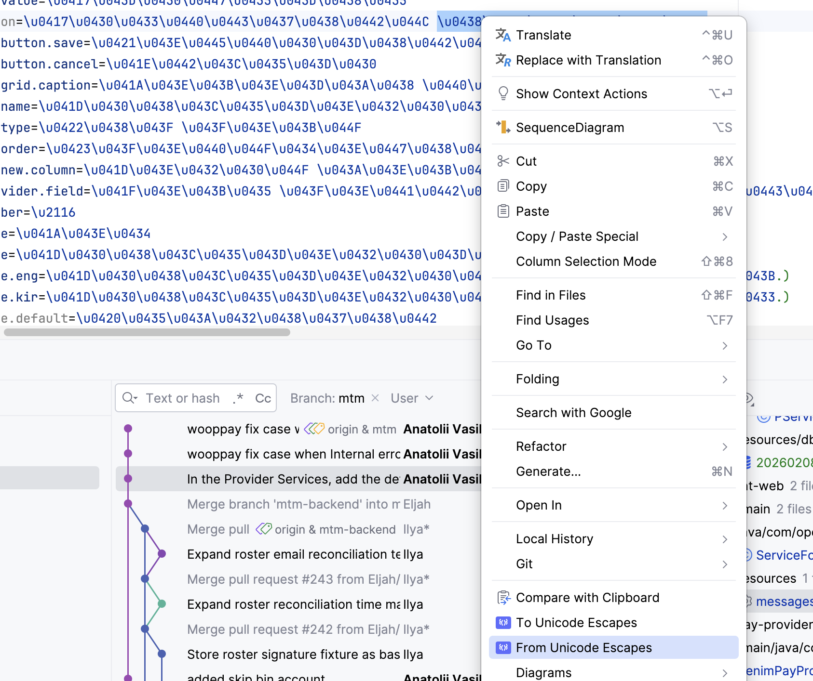

# Unicode Tikki

A JetBrains IDE plugin that converts non-ASCII Unicode characters to `\uXXXX` escape sequences and vice versa.



## Features

- **To Unicode Escapes** — converts non-ASCII characters (above U+007F) to `\uXXXX` sequences. ASCII characters remain unchanged.
- **From Unicode Escapes** — converts `\uXXXX` sequences back to their original characters.

Both actions are available from the editor context menu when text is selected.

## Example

| Direction | Input | Output |
|-----------|-------|--------|
| To Unicode | `Привет` | `\u041F\u0440\u0438\u0432\u0435\u0442` |
| From Unicode | `\u041F\u0440\u0438\u0432\u0435\u0442` | `Привет` |

## Requirements

- IntelliJ IDEA 2023.1+ (or any JetBrains IDE based on the IntelliJ Platform 231+)
- JDK 17+

## Installation

### From JetBrains Marketplace

1. Open **Settings** → **Plugins** → **Marketplace**
2. Search for **Unicode Tikki**
3. Click **Install**

Or install directly from the [JetBrains Plugins Repository](https://plugins.jetbrains.com/plugin/30129-unicode-tikki).

### From Source

```bash
git clone https://github.com/mySkillsKit/unicode-tikki.git
cd unicode-tikki
./gradlew buildPlugin
```

The plugin ZIP will be in `build/distributions/`. Install it via **Settings** → **Plugins** → **Install Plugin from Disk**.

## Usage

1. Select text in the editor
2. Right-click to open the context menu
3. Choose **To Unicode Escapes** or **From Unicode Escapes**

## Building

```bash
./gradlew build
```

## License

Copyright (c) Anatolii Vasilev
